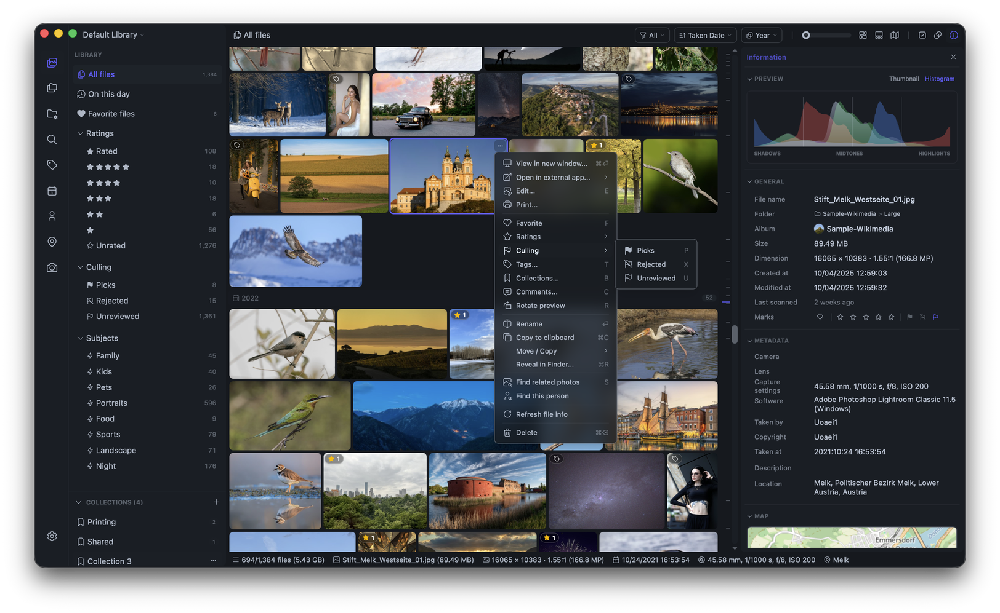
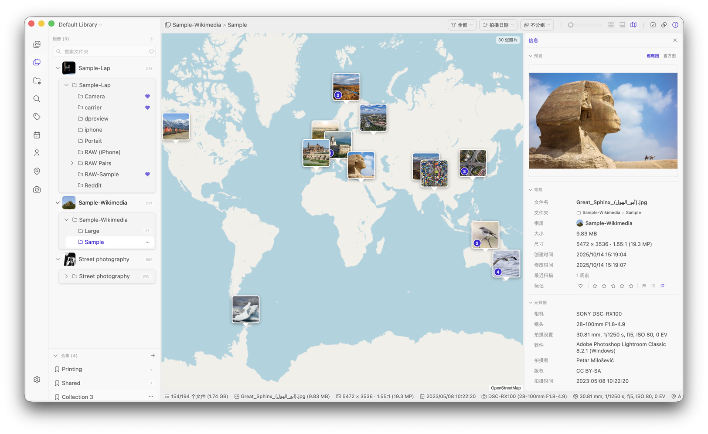

<div align="center">
  
  <h1>Lap - 프라이빗 로컬 사진 관리자</h1>
  <h3>macOS, Windows, Linux를 위한 오픈 소스 데스크톱 사진 관리 도구.</h3>
  <p>
    <a href="https://github.com/julyx10/lap/releases"></a>
    <a href="https://github.com/julyx10/lap/releases"></a>
    <a href="https://github.com/julyx10/lap/stargazers"></a>
  </p>
</div>

[English](../README.md) [Deutsch](README.de.md) | [Français](README.fr.md) | [Español](README.es.md) | [Português](README.pt.md) | [Русский](README.ru.md) | [简体中文](README.zh-CN.md) | [日本語](README.ja.md) | 한국어 |

Lap은 오픈 소스 기반의 '로컬 우선(local-first)' 사진 관리 도구입니다. 가족 앨범을 둘러보고, 오래된 사진을 빠르게 찾으며, 대규모 개인 미디어 라이브러리를 오프라인에서 직접 관리할 수 있도록 설계되었습니다.
클라우드 사진 서비스의 개인정보 보호 대안으로서, 강제 업로드 없음, 로컬 AI 검색, 폴더 우선 워크플로우를 제공하며 완전히 무료로 사용할 수 있습니다.

- 웹사이트: [https://julyx10.github.io/lap/](https://julyx10.github.io/lap/)
- 데모 비디오: [https://youtu.be/RbKqNKhbVUs](https://youtu.be/RbKqNKhbVUs)
- 개인정보 처리방침: [PRIVACY.md](../PRIVACY.md)

## Lap 다운로드

[최신 릴리스 페이지](https://github.com/julyx10/lap/releases/latest)를 열고, 시스템에 맞는 파일을 다운로드하세요.

| 플랫폼 | 패키지 | 비고 |
| :-- | :-- | :-- |
| **macOS (Apple Silicon / Intel)** | `_aarch64.dmg` / `_x64.dmg` | Apple 공증 완료 |
| **Windows 10/11 (x64 / ARM64)** | `_x64_en-US.msi` / `_arm64_en-US.msi` | 서명되지 않음 — SmartScreen이 다운로드를 차단하면 **보관**을 클릭하세요 |
| **Linux (amd64 / arm64)** | `_amd64.deb` / `_arm64.deb` | Debian 기반 배포판용（Ubuntu, Debian, Linux Mint 등） |

### Homebrew로 macOS에 설치

```bash
brew tap julyx10/lap
brew install --cask lap
```

## 스크린샷

<p align="center">
  
  
</p>

## 왜 Lap인가요?

- **로컬 우선 설계**: 사진은 사용자의 디스크에 보관되며, 클라우드 계정이나 업로드가 필요하지 않습니다.
- **라이브러리 종속 없음**: 모든 파일을 닫힌 데이터베이스로 가져오는 대신 기존 폴더를 직접 사용할 수 있습니다.
- **프라이빗 AI 도구**: 검색, 유사도, 스마트 태그, 얼굴 기능이 모두 사용자의 기기에서 로컬로 실행됩니다.
- **대규모 컬렉션에 최적화**: 10만 개 이상의 파일이 있는 라이브러리도 부드럽게 탐색하고 정리할 수 있도록 최적화되었습니다.
- **오픈 소스 및 무료**: 구독도, 강제 생태계도 없으며 코드를 직접 확인할 수 있습니다.

## 주요 기능

- **유연한 라이브러리 탐색**: 타임라인, 폴더, 위치, 카메라, 렌즈, 태그, 즐겨찾기, 평점, 피사체, 얼굴 필터를 제공합니다.
- **스마트 앨범**: 규칙 기반 보기를 저장하고 그룹화, 정렬, 순서를 사용자 지정할 수 있습니다.
- **컬렉션**: 원본 파일을 이동하거나 복제하지 않고 유연한 컬렉션으로 파일을 정리할 수 있습니다.
- **로컬 AI 검색**: 텍스트 프롬프트, 시각적 유사도, 피사체, 얼굴 클러스터링, 50개 이상 언어의 선택적 다국어 검색을 지원합니다.
- **Apple Live Photos**: HEIC/MOV 쌍을 인식해 뷰어에서 재생하고, 이름 변경, 이동, 복사, 삭제 시 연결된 MOV 및 AAE 사이드카 파일을 함께 처리합니다.
- **RAW + JPEG/HEIC 쌍**: 같은 폴더에서 이름이 같은 RAW 파일과 JPEG 또는 HEIC 짝 파일을 선택적으로 하나의 항목으로 그룹화합니다. 원본은 별도 파일로 유지되며, 이름 변경, 이동, 복사, 붙여넣기, 삭제 시 두 파일을 함께 처리합니다.
- **폴더 우선 워크플로**: 다중 라이브러리, 드래그 앤 드롭 가져오기, 복사/붙여넣기 가져오기, 파일 시스템 동기화, 안전한 이동/복사/삭제 작업을 지원합니다.
- **선별 및 비교 도구**: 최대 4장의 이미지를 비교할 수 있는 4분할 이미지 뷰어를 제공합니다.
- **정리 도구**: 중복 파일을 찾고 불필요한 파일을 휴지통으로 일괄 이동할 수 있습니다.
- **내장 편집**: 자르기, 회전, 뒤집기, 크기 조절 및 기본 이미지 보정을 지원합니다.
- **광범위한 포맷 지원**: 60개 이상의 사진, RAW, 비디오 포맷을 지원합니다.

## 메타데이터, 컬렉션 및 파일 이동

Lap은 폴더 우선으로 작동하지만, Lap에 표시되는 모든 정보가 원본 파일에 포함되어 있는 것은 아닙니다. Finder, 파일 탐색기 또는 다른 사진 앱에서도 같은 폴더를 관리한다면 이 차이를 이해하는 것이 중요합니다.

### 파일과 함께 유지되는 정보

- 원본 사진과 비디오는 기존 폴더에 있는 일반 파일로 항상 유지됩니다.
- EXIF 촬영 날짜, 카메라, 렌즈, GPS, 방향처럼 파일에 이미 포함된 메타데이터는 Lap이 파일을 인덱싱할 때 해당 파일에서 읽습니다.
- 내장 이미지 편집을 저장하면 결과 이미지가 선택한 대상 위치에 기록됩니다.
- 파일을 **Lap에서** 이름 변경, 이동, 복사 또는 삭제하면 Lap은 동시에 로컬 카탈로그를 업데이트합니다. Apple Live Photo 구성 요소, AAE 사이드카 파일 및 활성화한 RAW + JPEG/HEIC 쌍처럼 지원되는 연결 자산도 함께 처리합니다.

### Lap이 로컬에 저장하는 정보

다음 정보는 Lap의 라이브러리 데이터입니다. Lap의 로컬 데이터베이스 또는 라이브러리 구성에 저장되며 EXIF, IPTC 또는 XMP 사이드카에 기록되지 않습니다.

- 컬렉션, 태그, 댓글, 즐겨찾기, 평점 및 선별 상태(선택됨 및 제외됨)
- 스마트 앨범 및 그 규칙, 그룹화, 정렬 및 순서
- AI 검색 데이터, 얼굴 데이터, 썸네일 및 기타 인덱스 또는 캐시 데이터

이 데이터는 파일을 Lap 외부에서 복사, 내보내기 또는 이동할 때 파일과 함께 이동하지 않으며, 다른 앱에서 자동으로 사용할 수도 없습니다.

### Lap 외부에서 파일 작업하기

Lap은 폴더를 다시 스캔하고 많은 파일 시스템 변경 사항을 감지할 수 있습니다. 하지만 파일을 Lap 외부에서 이름 변경, 이동, 교체 또는 복사하면 Lap에만 저장된 정리 정보에 영향을 줄 수 있습니다.

컬렉션, 태그, 댓글, 즐겨찾기, 평점 또는 선별 상태를 사용하는 경우에는 가장 안정적인 방법으로 Lap에서 파일 이름을 변경하고 이동하세요. Lap 외부에서도 파일을 관리한다면 사진과 함께 Lap의 데이터베이스와 구성도 백업하세요. 데이터베이스 위치 관리와 백업 생성은 **설정 → 저장소**에서 할 수 있습니다.

Lap의 데이터베이스 또는 구성을 삭제하면 이 로컬 정리 정보와 인덱스 데이터는 제거되지만 원본 미디어 파일은 삭제되지 않습니다.

## Lap 제거

Lap은 기존 사진 폴더를 직접 사용합니다. Lap을 제거하거나 데이터베이스 및 캐시 파일을 삭제해도 원본 사진은 삭제되지 않습니다.

일반 제거 절차는 애플리케이션만 제거합니다. Lap을 완전히 제거하려면 먼저 Lap을 종료하고 애플리케이션을 제거한 다음, 사용 중인 플랫폼에 맞는 명령으로 로컬 데이터베이스, 썸네일 캐시 및 설정 파일을 삭제하세요.

### macOS

Homebrew로 Lap을 설치한 경우:

```bash
brew uninstall --cask lap
```

수동으로 설치한 경우 Lap을 종료하고 `Applications` 폴더의 `Lap.app`을 휴지통으로 이동하세요.

Lap 데이터베이스, 캐시 및 설정 파일을 모두 삭제하려면:

```bash
rm -rf "$HOME/Library/Application Support/com.julyx10.lap" \
       "$HOME/Library/Caches/com.julyx10.lap" \
       "$HOME/Library/WebKit/com.julyx10.lap"
rm -f "$HOME/Library/Preferences/com.julyx10.lap.plist"
```

### Windows

**설정 > 앱 > 설치된 앱**을 열고 **Lap**을 찾아 **제거**를 선택하세요.

그런 다음 PowerShell을 열고 Lap 데이터베이스, 캐시 및 설정 파일을 모두 삭제하세요:

```powershell
Remove-Item -Recurse -Force -ErrorAction SilentlyContinue "$env:LOCALAPPDATA\com.julyx10.lap"
Remove-Item -Recurse -Force -ErrorAction SilentlyContinue "$env:APPDATA\com.julyx10.lap"
```

### Linux

Debian 기반 배포판에서는 패키지를 제거하세요:

```bash
sudo apt remove lap
```

그런 다음 Lap 데이터베이스, 캐시 및 설정 파일을 모두 삭제하세요:

```bash
rm -rf "$HOME/.local/share/com.julyx10.lap" \
       "$HOME/.cache/com.julyx10.lap" \
       "$HOME/.config/com.julyx10.lap"
```

Lap 설정에서 사용자 지정 데이터베이스 저장 폴더를 선택했다면, 해당 폴더에 Lap 데이터베이스 파일만 포함되어 있는지 확인한 후 별도로 삭제하세요.

## 소스에서 빌드하기

요구 사양: Node.js 20+, pnpm, Rust stable.

```bash
# macOS 시스템 의존성
xcode-select --install
brew install nasm pkg-config autoconf automake libtool cmake

# Linux 시스템 의존성
# sudo apt install libwebkit2gtk-4.1-dev libappindicator3-dev librsvg2-dev \
#   patchelf nasm clang pkg-config autoconf automake libtool cmake

# 복제 및 빌드
git clone --recursive https://github.com/julyx10/lap.git
cd lap
git submodule update --init --recursive
cargo install tauri-cli --version "^2.0.0" --locked
./scripts/download_models.sh            # Windows: .\scripts\download_models.ps1
./scripts/download_ffmpeg_sidecar.sh    # Windows: .\scripts\download_ffmpeg_sidecar.ps1
cd src-vite && pnpm install && cd ..
cargo tauri dev
```

## 지원 포맷

Lap은 60개 이상의 사진, RAW, 비디오 포맷을 지원합니다.

| 유형 | 포맷 목록 |
| :--- | :--- |
| 이미지 | JPG/JPEG/JFIF, PNG, GIF, BMP, TIFF, WebP, HEIC/HEIF/HIF, AVIF, JXL, PSD, EXR, HDR/RGBE, TGA, JPEG 2000 (JP2/J2K/J2C/JPC/JPF/JPX), DDS, DPX, QOI |
| RAW 사진 | CR2, CR3, CRW, NEF, NRW, ARW, SRF, SR2, RAF, RW2, ORF, PEF, DNG, SRW, RWL, MRW, 3FR, MOS, DCR, KDC, ERF, MEF, RAW, MDC |
| 비디오 | MP4, MOV, M4V, MKV, AVI, FLV, TS/M2TS, WMV, WebM, 3GP/3G2, F4V, VOB, MPG/MPEG, ASF, DIVX 등. H.264 재생은 모든 플랫폼에서 지원되며, 네이티브 재생이 불가한 경우 자동으로 호환성 처리가 진행됩니다. HEVC/H.265 및 VP9은 macOS에서 네이티브 지원됩니다. |

### Linux 비디오 재생 참고 사항

Linux Mint/Ubuntu/Debian 사용자는 더 원활한 비디오 재생을 위해 아래 패키지를 설치해야 합니다.

```bash
sudo apt install gstreamer1.0-libav gstreamer1.0-plugins-good
```

## 아키텍처

- Core: Tauri + Rust
- Frontend: Vue + Vite + Tailwind CSS
- Data: SQLite

### 주요 라이브러리

| 라이브러리 | 용도 |
| :-- | :-- |
| [LibRaw](https://github.com/LibRaw/LibRaw) | RAW 이미지 디코딩 및 썸네일 추출 |
| [libheif](https://github.com/strukturag/libheif) | HEIC/HEIF/HIF 이미지 디코딩 및 미리보기 생성 |
| [libjpeg-turbo](https://libjpeg-turbo.org/) | 빠른 JPEG 디코딩 및 썸네일 생성 |
| [FFmpeg](https://ffmpeg.org/) | 비디오 처리 및 썸네일 생성 |
| [Video.js](https://videojs.com/) | 교차 플랫폼 비디오 재생 UI |
| [ONNX Runtime](https://onnxruntime.ai/) | 로컬 AI 모델 추론 엔진 |
| [CLIP](https://github.com/openai/CLIP) | 이미지-텍스트 유사도 검색 |
| [InsightFace](https://github.com/deepinsight/insightface) | 얼굴 감지 및 인식 |
| [Leaflet](https://leafletjs.com/) | 위치 정보가 포함된 사진을 위한 대화형 지도 |
| [daisyUI](https://daisyui.com/) | UI 컴포넌트 라이브러리 |

## 라이선스

GPL-3.0-or-later. 자세한 내용은 [LICENSE](../LICENSE)를 참조하세요.
